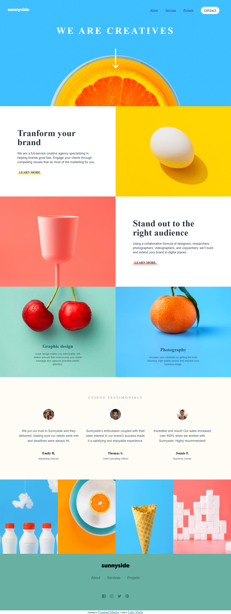

# Frontend Mentor - Sunnyside agency landing page solution

This is a solution to the [Sunnyside agency landing page challenge on Frontend Mentor](https://www.frontendmentor.io/challenges/sunnyside-agency-landing-page-7yVs3B6ef). Frontend Mentor challenges help you improve your coding skills by building realistic projects.

## Table of contents

- [Overview](#overview)
  - [The challenge](#the-challenge)
  - [Screenshot](#screenshot)
  - [Links](#links)
- [My process](#my-process)
  - [Built with](#built-with)
  - [What I learned](#what-i-learned)
  - [Continued development](#continued-development)
  - [Useful resources](#useful-resources)
- [Author](#author)
- [Acknowledgments](#acknowledgments)

**Note: Delete this note and update the table of contents based on what sections you keep.**

## Overview

### The challenge

Users should be able to:

- View the optimal layout for the site depending on their device's screen size
- See hover states for all interactive elements on the page

### Screenshot



### Links

- Solution URL: [Add solution URL here](https://your-solution-url.com)
- Live Site URL: [Add live site URL here](https://your-live-site-url.com)

## My process
I firstly completed the design with HTML then applied CSS to make my design more appealing. To make it responsive; i have made use of JS. Since i struggled to use CSS grid, i used article for the main body and it turned out perfectly fine. 
### Built with

- Semantic HTML5 markup
- CSS custom properties
- Flexbox
- CSS Grid
- JS library

### What I learned

```
<section> made it easy to accomodate my image-header along with <a> links```

```html
div, artcle and other general tags assist in building the website structure
```

```css
. for class modifications referrence
# for single identification editing
* accommodates/affects everything
It basically makes the website design more appealing
It actually overpowers HTML
}
```

```js
creating validation functions using if-else statements
```
```See hover states for all interactive elements on the page
Triggered when users place the cursor on responsive tags
```

If you want more help with writing markdown, we'd recommend checking out [The Markdown Guide](https://www.markdownguide.org/) to learn more.

**Note: Delete this note and the content within this section and replace with your own learnings.**

### Continued development

I would love to work on the dropdown image, add some effects to it for more appeal.
Add more responsive pages.

### Useful resources

- [Example resource 1](https://www.w3schools.com/) - This helped me for html, css and javascrpt features clear understanding. I really liked this platform and will use it going forward.
- [Example resource 2](https://github.com/uzoway/sunnyside-agency-landing-page) - This is an amazing code which helped me construct the layout as i could not structure my tables well. It finally gave me a clear understanding of article and div. I'd recommend it to anyone still learning this concept. It makes it better to improve the code.

## Author

- Website - [Add your name here](https://www.your-site.com)
- Frontend Mentor - [@moila](https://www.frontendmentor.io/profile/LettyMoila)
- Twitter - [@LettyMoila](https://www.twitter.com/Letty_Moila)

## Acknowledgments

Gratitude to Shobane Manthata with helping me taking a screenshot of my website by reccommending a chrome extension.
